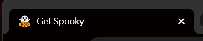

# First React with JSX

**Subjects**: JSX (syntax exension for JS), Vite(building tool) Project, useState, and ternary operators.

**Section**: React.js, **Type**: Core

### Purpose:

- Created a new React project using `Vite`.
- Changed the `App.jsx` component.
- Adjusted the CSS by changing `App.css` and using the JSX attribute `className`.

---

- [x]  Use the terminal to generate a Vite-scaffolded React application.

- [x]  Use JSX to display "Hello Dojo"

- [x]  Use JSX to display a todo list🔮

… Yea that got boring. Turned my list into quotes and sifted through them with on click 🔮

